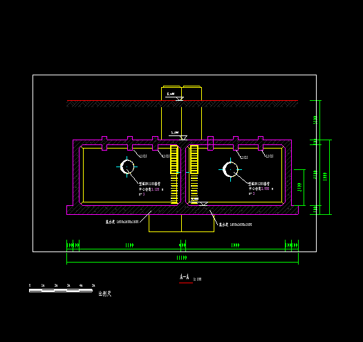
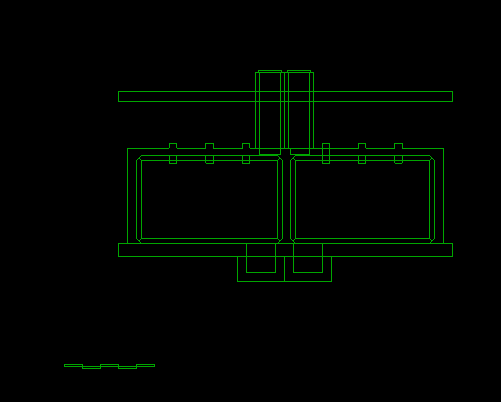
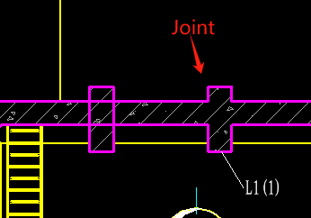
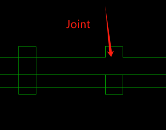
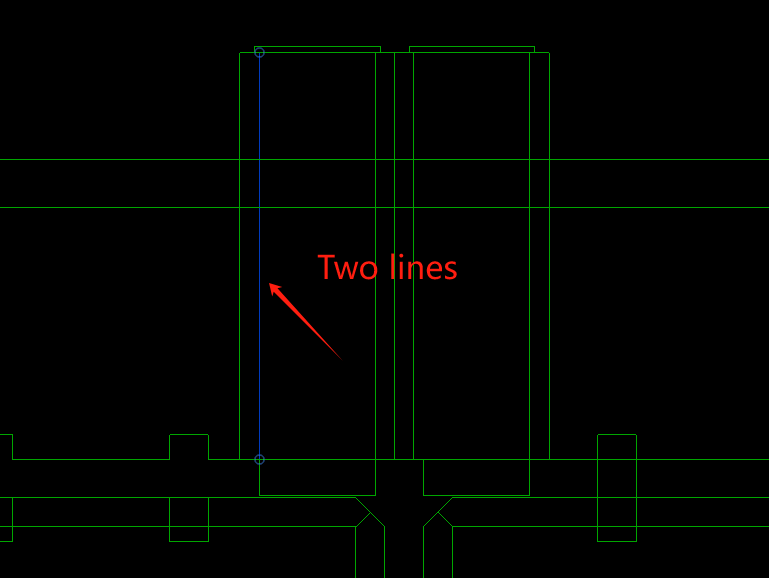
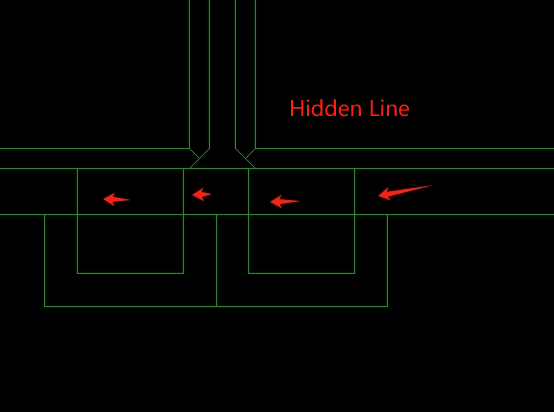

I want to get section geometry from a Revit view. Thanks to Jeremy Tammik for his post [Autodesk Developer Blog: Retrieving Section View Intersection Cut Geometry](https://blog.autodesk.io/retrieving-section-view-intersection-cut-geometry/) and the code [SectionCutGeo: Revit C# .NET add-in to retrieve section view cut geometry](https://github.com/jeremytammik/SectionCutGeo).

This helped me understand more details about `GeometryElement` and `GetInstanceGeometry`. When the `GeometryElement` option is already set to `ViewSection`, `GetInstanceGeometry` will use that section as the default.

I set up a more detailed experiment. I got all the lines of a section, and **projected lines** onto the section view (including curves inside and outside the section), then plotted them, as seen below.

I think this gives us more information about how the view is rendered. Here are some observations:





- When we filter the curves in the section, we only get the pink ones in **the first image**.
  - Lines inside the section will consider the geometry join effect between different elements, but for nested families, lines may not be affected by the geometry join effect.

  

  

- When we choose all, the image looks like **the second one**.
  - So, when a face is visible, its edges are projected onto the section. The same location can have **multiple lines** due to different distances to the section and clip line settings.
  
  - 
  
     
  
  - The view might be rendered according to distance and visibility override relationships. It is somewhat similar to **AutoCAD area zone overrides**.

- 2D view rendering might be  quite a complicated thing.

Here is some code that differs from [SectionCutGeo: Revit C# .NET add-in to retrieve section view cut geometry](https://github.com/jeremytammik/SectionCutGeo).

```csharp
using(Transaction tx = new Transaction(doc))
{
    tx.Start("Create Section Cut Model Curves");

    SketchPlane plane3 = SketchPlane.Create(doc, plane2);

    foreach(Curve c in curves)
    {
        Curve projectedLine;
        // 将 c 投影到 plane2 上，形成一个新的 Curve 对象 projectedCurve 
        // 仅适用于 Line
        Line line = c as Line;
        if(line != null)
        {
            XYZ p1 = line.GetEndPoint(0);
            XYZ p2 = line.GetEndPoint(1);

            // 将两个端点投影到平面上
            XYZ projP1 = ProjectPointToPlane(p1, plane2);
            XYZ projP2 = ProjectPointToPlane(p2, plane2);

            // 创建新的直线
            if(projP1.DistanceTo(projP2) > 1e-3)
            {
                projectedLine = Line.CreateBound(projP1, projP2);
                if(projectedLine.Length > 1e-3)
                {
                    doc.Create.NewModelCurve(projectedLine, plane3);
                }
            }
        }
    }


    tx.Commit();
}
```


